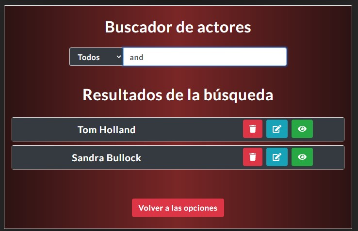
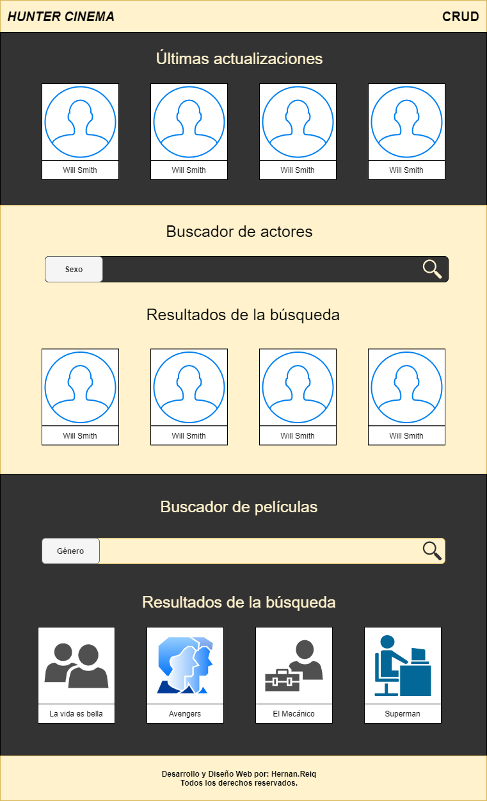

# Hunter-Cinema
Prueba técnica. 
___
## Detalles
* Buscador con filtros para actores y películas. 
* CRUD para actores y películas. 
* Saneamiento de datos para evitar redundancias. 
___
## Secciones del Index
### **Últimas actualizaciones**
Se motrará la información de los últimos 4 actores añadidos o editados.
### **Buscador de actores / Resultados de la búsqueda**
Permite realizar búsquedas por sexo de los actores guardados en la base de datos.
### **Buscador de películas / Resultados de la búsqueda**
Permite realizar búsquedas por género de las películas guardados en la base de datos.
___
## Secciones del CRUD de actores
### **Crear actores**
* No permite crear actores con nombres duplicados, es decir, dos actores no pueden llamarse exactamente igual.
* Hace un saneamiento con los campos, verificando que este contenga letras, por lo que si el campo se deja en blanco o es llenado con espacios, no se podrá crear el actor.
* Permite subir una foto del actor en el formulario.
### **Buscar un actor**
* Para poder ver, eliminar o actualizar un actor es necesario buscarlo en el CRUD.
* Las búsquedas solamente se hacen por nombre y sexo.
* Las búsquedas se hacen a medida que se va escribiendo, por lo que si el actor posee alguna de las secuencias de letras presionadas entonces aparecerá en los resultados.
* Si no se elige ningún filtro, se harán búsquedas generales de todos los actores, aunque sólo mostrará resultados de los últimos 4 que coincidan con la búsqueda.
* Si luego de hacer la búsqueda se cambia el filtro, entonces la búsqueda se actualizará y mostrará las que conincidan con el nuevo filtro.
* **CRUD:** cuando se realiza una búsqueda, se muestra el nombre del actor y las opciones de "Eliminar" (Rojo - Bote de basura), "Actualizar" (Azul - Lapíz) o "Ver" (Verde - Ojo), representados con iconos.

* **INDEX:** cuando se realiza una búsqueda, se muestra una foto del actor, su nombre y la opción de ver los detalles.

### **Ver un actor**
* **CRUD e INDEX** Muestra en una ventana emergente (Pop Up) los detalles del actor, incluido las películas en las que este ha trabajado.

### **Actualizar un actor**
* Al cambiar el nombre del actor, este se actualiza en todas las películas en las que ha trabajado. 
* El actualizador permite cambiar datos específicos, por lo que no es necesario actualizar todos los datos.

* Si no se ha elegido la opción de editar algún dato, no te permite enviar el formulario.
### **Eliminar un actor**
* Borra la foto y la información perteneciente al actor.
* Borra el nombre del actor en todas las películas en donde esté registrado.

___
## Composición web del Index (Hecho por mi)

___
## Creador: Hernan Demorizi Ureña
### [Portafolio de proyectos y habilidades](https://hernanreiq.github.io/portafolio/)